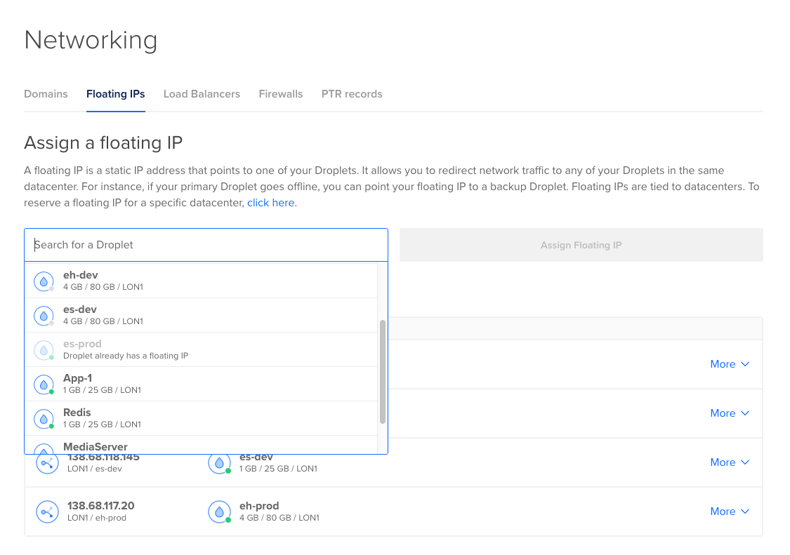

<small>
  <b>cicd</b> 
  This repository hosts CI/CD relevant scripts and documentation.
</small>

# AWS Infrastructure Provisioning

This document is how to set up CI/CD of PHP application with AWS CloudFormation.

## Create a droplet

When you first create a new DO droplet, you should take some [initial setup][1] to secure it, install and setup stuff. All these routines can be done with Cloud Init. During creating a droplet, paste content of [cloudinit.sh](cloudinit.sh) into _User Data_ as per the following picture:

## SSL certificates

[Configure SSL][2] using [Let's Encrypt][3]

To issue a single SSL certificate and auto-setup Nginx execute following:   
`sudo certbot --nginx -n --agree-tos -m <YOUR_EMAIL> --redirect -d <YOUR_DOMAIN>`  
Follow instructions by _certbot_ and deploy a DNS TXT record in order to verify the domain ownership. Once done, you are free to use the domain wildcard SSL certificate with Nginx.

To issue a wildcard SSL certificate, log in to the server via SSH and execute following:  
`sudo certbot certonly --manual --preferred-challenges=dns --agree-tos -m <YOUR_EMAIL> -d *.<YOUR_DOMAIN>`

> __Hints__  
> `sudo certbot certificates` to cross verify certificates validity  
> `sudo certbot renew --dry-run` to test automatic renewal of certificates  
> `sudo certbot delete --cert-name <YOUR_DOMAIN>` to delete certificate

## Static IP

Assign the droplet with Floating IP as follows:

[1]: https://www.digitalocean.com/community/tutorials/initial-server-setup-with-debian-10
[2]: https://www.digitalocean.com/community/tutorials/how-to-secure-nginx-with-let-s-encrypt-on-debian-10
[3]: https://certbot.eff.org/lets-encrypt/debianbuster-nginx
